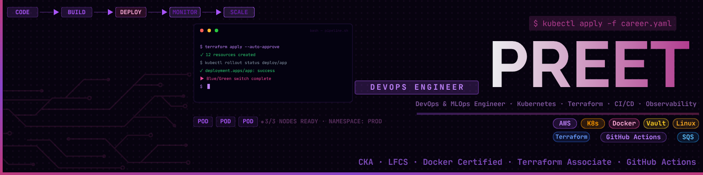
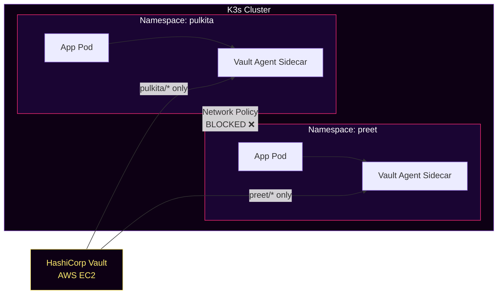
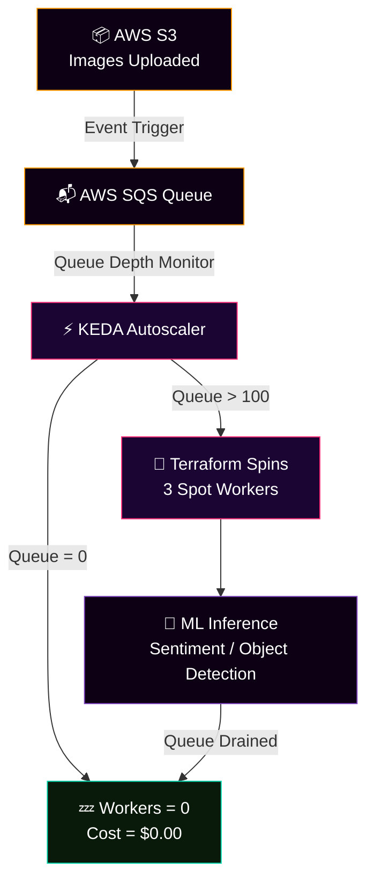
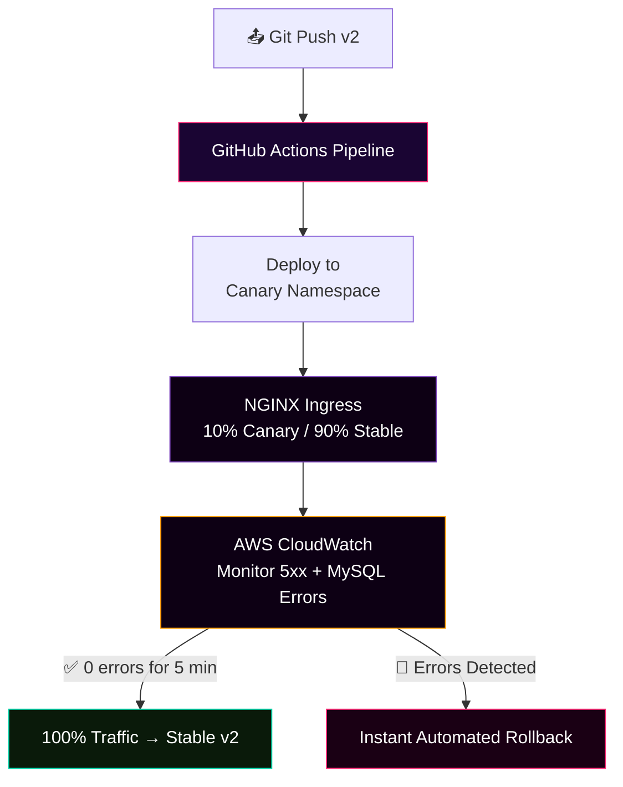

 

---

### `$ kubectl apply -f career.yaml`

*DevOps & MLOps Engineer · Zero-Trust Security · FinOps Cost Optimization*

---

## 👋 About Me

I'm a hands-on **DevOps and MLOps Engineer** focused on building production-grade, secure, and hyper-efficient infrastructure. I bypass the theoretical fluff to design resilient, cloud-native ecosystems from scratch.

My engineering philosophy anchors on two pillars:

- 🔐 **Zero-Trust Security** — making infrastructure bulletproof from the ground up
- 💸 **FinOps Cost Optimization** — driving idle resource costs down to absolute zero

---

## 🛠️ Core Tech Stack

| Category | Technologies |
| :--- | :--- |
| **Container Orchestration & OS** | Kubernetes (CKA-level), Docker, K3s, Linux (LFCS-level), Bash |
| **Infrastructure as Code & CI/CD** | Terraform, GitHub Actions, NGINX Ingress |
| **Cloud Infrastructure** | AWS (EC2, S3, SQS, CloudWatch, IAM) |
| **Data & Languages** | Python (ML-focused), MySQL |
| **Specialized Architecture** | KEDA, HashiCorp Vault |

---

## 🚀 Featured Projects

### 1. Multi-Tenant Namespace Shield — HashiCorp Vault 🔒

> *Zero hardcoded credentials. Zero cross-tenant leakage. Zero compromise.*

**The Problem:** In shared Kubernetes clusters, weak RBAC means Tenant A can discover Tenant B's database credentials. Standard Kubernetes Secrets are only Base64 encoded — not encrypted.

**The Solution:** Implemented strict Kubernetes Network Policies for total namespace isolation between `pulkita-workspace` and `preet-workspace`. Integrated HashiCorp Vault on a centralized AWS Commander node to dynamically inject MySQL credentials into running pods at runtime — achieving a true Zero-Trust environment.

**Key Tech:** `Kubernetes` `HashiCorp Vault` `K3s` `MySQL` `Linux` `AWS EC2`

---

### 2. Scale-to-Zero ML Inference API 📉

> *If no work exists, no cost exists. Idle = $0.00.*

**The Problem:** ML workloads are expensive. Running GPU/compute nodes 24/7 for intermittent inference requests is pure cloud waste.

**The Solution:** Deployed a containerized ML sentiment analysis model integrated with KEDA monitoring an AWS SQS queue. When idle, worker nodes scale entirely to **zero**. When 100+ images hit AWS S3, a Terraform workflow dynamically spins up 3 Spot Workers to handle the burst — then scales back to zero when done.

**Key Tech:** `KEDA` `Docker` `Python` `Terraform` `AWS SQS` `AWS S3`

---

### 3. CloudWatch-Driven Canary Deployment Engine 🦅

> *Ship fast. Catch failures before users do. Roll back in seconds.*

**The Problem:** Traditional deployments are binary — you're either fully deployed or fully rolled back. There's no safe middle ground to validate new code against real production traffic.

**The Solution:** Engineered a GitHub Actions pipeline that ships v2 of a Python API into a dedicated preview namespace. NGINX Ingress handles smart traffic splitting (10% Canary / 90% Stable). The pipeline actively queries AWS CloudWatch Log Insights for MySQL error strings and HTTP 5xx codes. If error telemetry stays flat for 5 minutes → automatic full promotion. If errors spike → instant automated rollback.

**Key Tech:** `GitHub Actions` `NGINX Ingress` `AWS CloudWatch` `Python` `Kubernetes`

---

## 📊 What I'm Building Right Now

- 🏗️ Designing cost-optimized, automated infrastructure blueprints
- 🤖 Bridging the gap between Data Science and Infrastructure with robust MLOps patterns
- ✍️ Documenting engineering breakdowns on [Hashnode](https://yourhashnode.com) · [Dev.to](https://dev.to/yourusername)

---

## 🤝 Let's Connect

 

*"Production-ready execution over theory. Let's build something scalable."*

